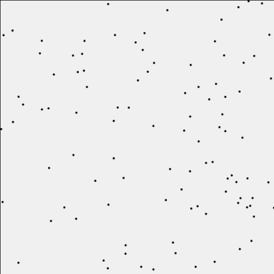

# Microcanonical Ensemble Model Simulation

This repository contains a single instance simulation of a microcanonical ensemble model. The microcanonical ensemble represents an isolated system with a fixed number of particles, volume, and total energy. In this model, the energy is conserved and distributed among the particles in the system. This ensemble is particularly useful for studying isolated systems and fundamental thermodynamic properties.

## Simulation

The simulation can be run at this link:
[http://galenwilkerson.github.io/micro_canonical_single_instance.html](http://galenwilkerson.github.io/micro_canonical_single_instance.html)

## Repository

The repository is located at: [https://github.com/galenwilkerson/micro-canonical-model](https://github.com/galenwilkerson/micro-canonical-model)

## Features

- Adjustable number of particles
- Adjustable total energy
- Adjustable simulation time limit
- Adjustable volume change rate (to demonstrate adiabatic processes)
- Start and stop controls for the simulation

## Controls

- **Number of Particles**: Use the slider to adjust the number of particles in the system.
- **Total Energy**: Use the slider to adjust the total energy of the system.
- **Time Limit**: Use the slider to set the maximum duration for the simulation.
- **Volume Change Rate**: Use the slider to set the rate at which the volume changes (for adiabatic process demonstration).
- **Start Simulation**: Click to start the simulation.
- **Stop Simulation**: Click to stop the simulation.

## Description

The microcanonical ensemble represents an isolated system with a fixed number of particles, volume, and total energy. In this model, the energy is conserved and distributed among the particles in the system. This ensemble is particularly useful for studying isolated systems and fundamental thermodynamic properties.

## How to Use

1. Adjust the sliders to set the desired number of particles, total energy, simulation time limit, and volume change rate.
2. Click the "Start Simulation" button to begin the simulation.
3. Observe the particles moving within the canvas. The particles will bounce off the walls and each other, demonstrating the dynamics of the system.
4. Click the "Stop Simulation" button to halt the simulation at any time.

## License

This project is licensed under the MIT License. See the [LICENSE](LICENSE) file for details.
